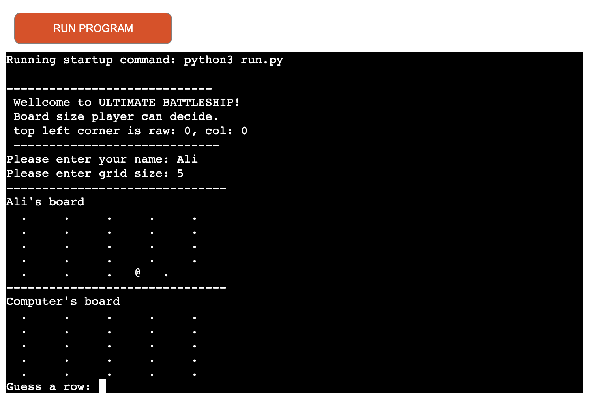
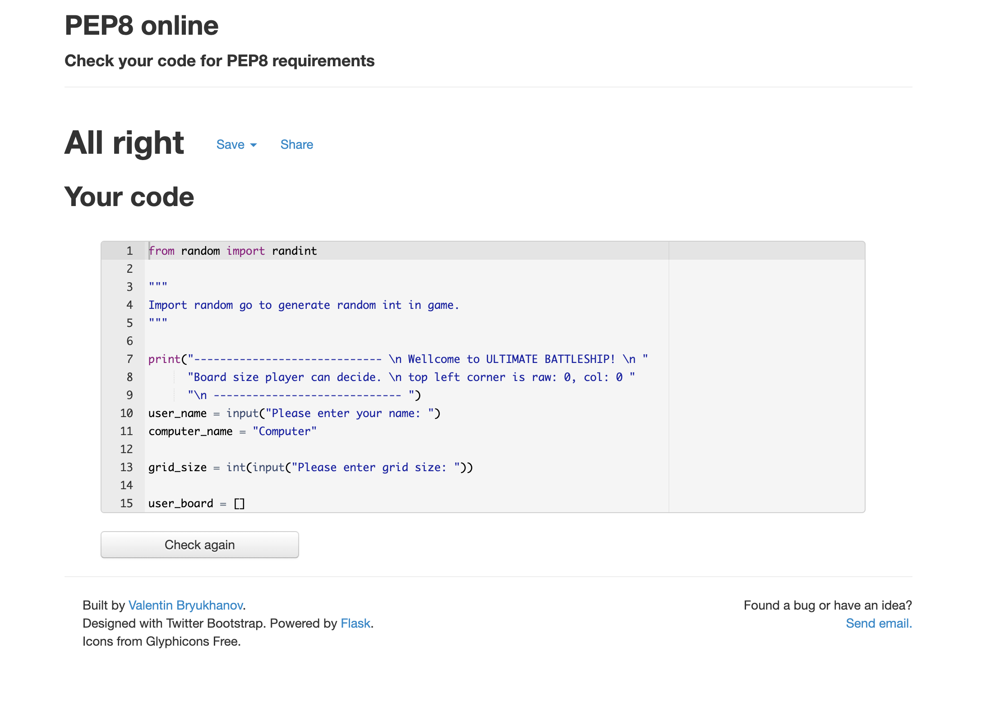

# Battleship Game
Ultimate Battleship is a python terminal game. Which run on Heroku site.

User can try to beat the the computer by find the computer battleship before the computer find there.

Here is the screen of my project

## How to play
Battleship game is based on the classic pen and papper game. If you want to learn more about battleship please visit Wikipedia site. In this version The player enter there name and two board are rendomly generated. 
The player can see where there ship are and it's indikated by '@' sign. User can create there grid size colum and row. The computer and the player then take it in turns to make guesses and try to sink each other battleship.

## Features 

### Existing Features
    - Random board generated
    - ships a placed rendomly on both the player and    computer board
    - player cannot see where the computer's ships are
    - Play against the Computer
    - Player cannot enter same guess twice

### Future 
- Player can select grid size row and colum

## Data Model 

## Testing
I have manually tested this project by www.peponline.com and confirm that there are no problem
Tested in my local terminal and the Code Institute Heroku terminal.

## Bugs

#### Solving Bug
First i test write my project code in pycharm and everything is well but when i write project code in github and showing too mutch error. But i fixed all.

## Remaining Bugs 
No bugs remaining

## Validator Testing
No error ware return from pep8online.com

## Deployment
This project was deployed using Code Institute's mock terminal Heroku

 - Create a new Heroku app
 - Set the buildbacks to python and NodeJS in the order
 - Link the Heroku app to the repositoty
 - click to diploy

## Credit

- Wikipedia for the details of the Battleships game
- Code Institute for the deployment terminal
- W3School and stackoverflow
